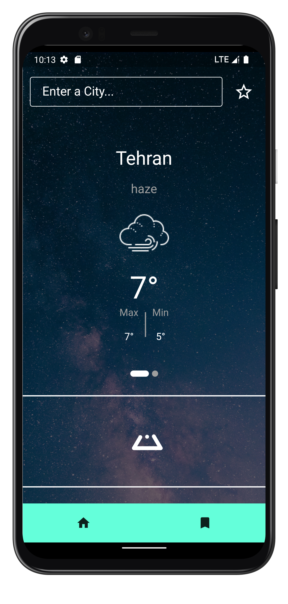
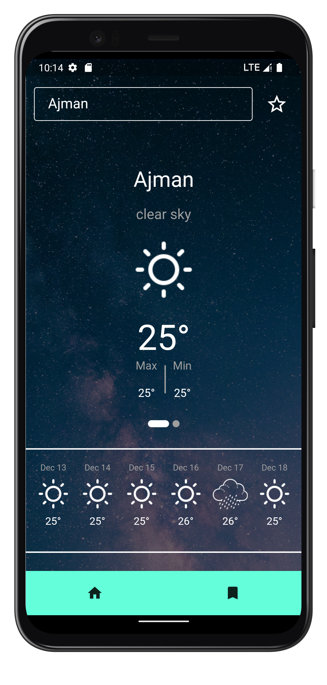
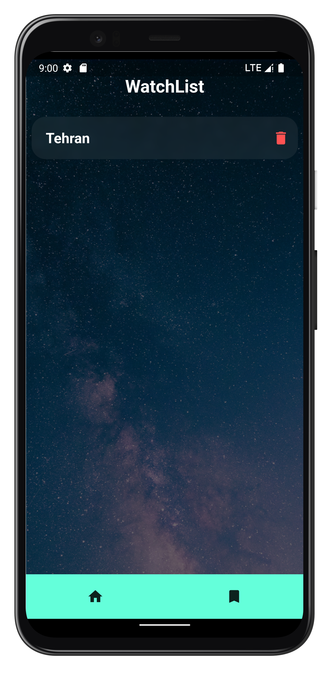
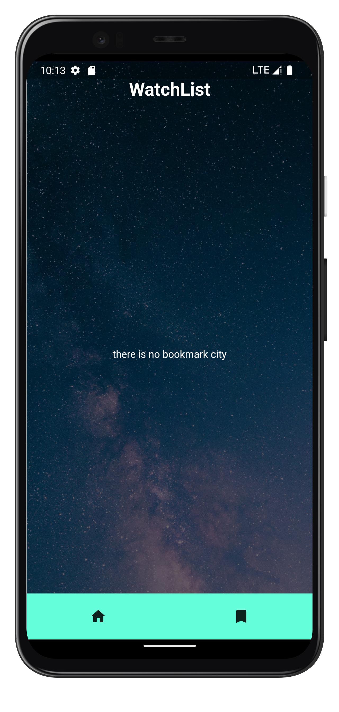

# weather
- Use Open Weather Map Api
- Use Dio 
- Use Bloc
- Use Google Font 
- Use Smooth Indicator 
- Use Lint
- Use Equtable
- Use Floor
- Use Flutter Typeahead
- Use Intl
- Use Get IT
- Use Loading Animation Widget  
   

